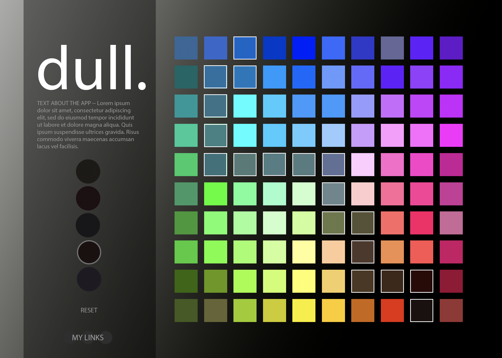

# dull.

## BACKGROUND & OVERVIEW
Dull is a color-mixing game that allows you to explore the art of color-mixing. One of the beauties of subtractive color mixing (like paint mixing) is that the more you mix, the more the color turns dull… Many painters will tell you, don’t over mix your colors, but with dull that is the point of the game!

 - BOARD:  A 10 x 10 grid of 100 different color tiles.

 - 

## Functionality and MVPs

-	Players will be presented a start position, target tile and a target mixed color.
-	They will continue to mix colors creating a path of combinations.
-	(Subtractive color will be used, same as paint mixing)
-	Once the current color hits one of the target dull color range, the grid turn back over to the original colors, the completed color gets marked off, and the players searches of the next color.
-	The path cannot overlap with itself, so the board will automatically refresh if the path can go no further and the color range was not hit. Prompting the user to start fresh.
-	(Additive version – Since colors do not mix to a dull color in additive mixing, users will keep working off the path they are on and see how many colors they can collect before their path can go no further)

## Wireframes

- /src
 - /styles
    - scss
 - /assets
    - logo.png
    - buttons...
 - index.js
 - /js
    - gridTile.js
    - colors.js
    - game.js
    - utils.js

## Architecture & Technology

-	Javascript
-	HTML
-	Sass
-	Webpack
-	Color Libraries:
 - JQuery & JQuery Color
 - Subtractive Library: Color_mixer -https://github.com/AndreasSoiron/Color_mixer
 - Additive Library: Chroma.js - https://gka.github.io/chroma.js/

## Timeline
-	Color mixing testing and setup (1 day)
-	Create layout and color mixing logic (1 day)
-	Create gameplay with target colors (2 days)
-	Finish styling (1 day)
